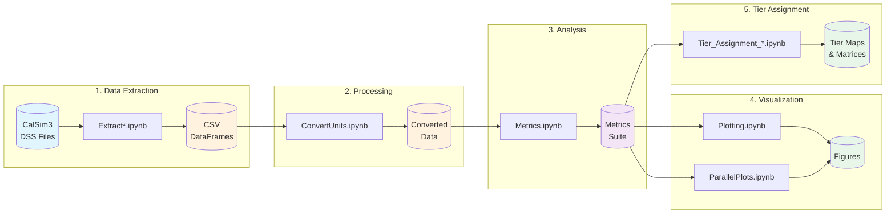

<p align="center">
  <a href="https://coeqwal.berkeley.edu/">
    
  </a>
</p>

<h1 align="center">COEQWAL Analysis Toolkit</h1>

<p align="center">
  <strong>Python toolkit for California water system modeling analysis</strong><br>
  Supporting the <a href="https://coeqwal.berkeley.edu/">Collaboratory for Equity in Water Allocation</a>
</p>

<p align="center">
  
  
  
</p>

<p align="center">
  <a href="#overview">Overview</a> •
  <a href="#background">Background</a> •
  <a href="#workflows">Workflows</a> •
  <a href="#repository-structure">Structure</a> •
  <a href="#getting-started">Getting Started</a> •
  <a href="#contact">Contact</a>
</p>

---

## Overview

**COEQWAL** (Collaboratory for Equity in Water Allocation) is a UC Berkeley research initiative envisioning the future of California's water with a focus on equity in allocation across stakeholders and communities.

This repository provides the **analysis toolkit** for:

- Extracting time series data from **CalSim3** DSS simulation files
- Computing **performance metrics** across water management scenarios
- Generating **publication-ready visualizations**
- Assigning **tier-based outcome measures** for system performance

---

## Background

### What is CalSim3?

**CalSim3** is the State of California's planning model for the Central Valley Project (CVP) and State Water Project (SWP). It simulates reservoir operations, water deliveries, and environmental flows across California's interconnected water system.

- **Input**: Hydrologic conditions, infrastructure, regulations, demands
- **Output**: Monthly time series stored in HEC-DSS format
- **Scenarios**: Different policy/climate assumptions (e.g., `s0001`, `s0020`)

### Water Year Convention

California uses an **October-September water year**:

```
Water Year 2020 = October 2019 → September 2020
```

A month is assigned to water year `N+1` if `month >= 10`.

### Tier-Based Outcome Measures

Scenarios are classified into **performance tiers** (1-4):

| Tier | Meaning | Color |
|------|---------|-------|
| **1** | Best performance / No degradation | Green |
| **2** | Acceptable / Minor degradation | Blue |
| **3** | Concerning / Moderate degradation | Yellow |
| **4** | Worst performance / Severe degradation | Red |

---

## Workflows



### 1. Data Extraction <sup>(Windows Required)</sup>

Extract time series from CalSim3 DSS files. Creates compound variables for total storage, deliveries, and flows.

| Notebook | Purpose |
|----------|---------|
| `ExtractStudiesFromDssAndCompoundVariablesCalSim3.ipynb` | Main variables |
| `ExtractDeliveryVariablesCalSim3.ipynb` | Delivery breakdowns |
| `ExtractGroundWaterDataCalSim3.ipynb` | Groundwater data |

### 2. Unit Conversion

Convert flow units (CFS) to volume units (TAF) using metadata from Excel configuration files.

| Notebook | Purpose |
|----------|---------|
| `ConvertUnits.ipynb` | Main variable conversion |
| `ConvertDeliveryUnits.ipynb` | Delivery variable conversion |

### 3. Metrics Computation

Calculate statistical measures across scenarios:

| Metric | Function | Description |
|--------|----------|-------------|
| Annual means | `compute_annual_means()` | Water year averages |
| Annual sums | `compute_annual_sums()` | Water year totals |
| Exceedance | `plot_exceedance_multi()` | Probability of exceeding levels |
| Threshold frequency | `frequency_hitting_level()` | Flood/deadpool events |
| CV | `compute_cv()` | Inter-annual variability |
| Percent change | `percent_change_from_baseline()` | Scenario vs baseline |

### 4. Visualization

Generate publication-ready plots:

| Plot Type | Function | Use Case |
|-----------|----------|----------|
| Time series | `plot_ts_multi()` | Temporal patterns |
| Exceedance curves | `plot_exceedance_multi()` | Reliability analysis |
| Month-of-year | `plot_moy_averages_multi()` | Seasonal patterns |
| Annual totals | `plot_annual_totals_ts_multi()` | Year-over-year trends |
| Parallel coordinates | `ParallelPlots.ipynb` | Multi-metric comparison |

### 5. Tier Assignment

Classify scenarios into performance tiers:

| Notebook | Category | Criteria |
|----------|----------|----------|
| `Tier_Assignment_FloodRisk.ipynb` | Flood Risk | Reservoir flood pool encroachment probability |
| `Tier_Assignment_Salinity.ipynb` | Salinity | Delta water quality (X2 position, EC levels) |
| `Tier_Assignment_Storage.ipynb` | Storage | Reservoir levels vs CDEC historical percentiles |
| `Tier_Assignment_GroundWater.ipynb` | Groundwater | Storage trends and decline rates |

---

## Repository Structure

```
coeqwal/
├── notebooks/
│   ├── coeqwalpackage/            # Core Python modules
│   │   ├── metrics.py             #   Statistical computations
│   │   ├── plotting.py            #   Visualization functions
│   │   ├── tier.py                #   Tier assignment logic
│   │   ├── cqwlutils.py           #   Utility functions (Excel I/O, paths)
│   │   ├── DataExtraction.py      #   DSS data extraction
│   │   ├── cs3.py                 #   CalSim3 interface
│   │   ├── AuxFunctions.py        #   Helper functions
│   │   ├── csPlots.py             #   Legacy plotting
│   │   ├── cs_util.py             #   CalSim utilities
│   │   └── dss3_functions_reference.py  # DSS library wrapper
│   │
│   ├── # === Data Extraction ===
│   │   ExtractStudiesFromDssAndCompoundVariablesCalSim3.ipynb
│   │   ExtractDeliveryVariablesCalSim3.ipynb
│   │   ExtractGroundWaterDataCalSim3.ipynb
│   │
│   ├── # === Unit Conversion ===
│   │   ConvertUnits.ipynb
│   │   ConvertDeliveryUnits.ipynb
│   │
│   ├── # === Analysis ===
│   │   Metrics.ipynb
│   │   ComputeGroundWaterTrends.ipynb
│   │   Scenario_Review.ipynb
│   │
│   ├── # === Visualization ===
│   │   Plotting.ipynb
│   │   ParallelPlots.ipynb
│   │   Dashboard.ipynb
│   │
│   ├── # === Tier Assignment ===
│   │   Tier_Assignment_FloodRisk.ipynb
│   │   Tier_Assignment_Salinity.ipynb
│   │   Tier_Assignment_Storage.ipynb
│   │   Tier_Assignment_GroundWater.ipynb
│   │
│   ├── # === Configuration Files ===
│   │   CalSim3DataExtractionInitFile_v4.xlsx
│   │   CalSim3DeliveryDataExtractionInitFile_v1.xlsx
│   │   CalSim3GroundWaterDataExtractionInitFile_v1.xlsx
│   │   CalSim3_WBA.csv
│   │   CalSim3GWregionIndex.wresl
│   │
│   └── shapefiles/                # GIS data for mapping
│
└── output/                        # Generated results
```

---

## Key Variables

### Reservoir Storage
| Variable | Reservoir |
|----------|-----------|
| `S_SHSTA_` | Shasta |
| `S_OROVL_` | Oroville |
| `S_TRNTY_` | Trinity |
| `S_FOLSM_` | Folsom |
| `S_MELON_` | New Melones |
| `S_MLRTN_` | Millerton |
| `S_SLUIS_SWP` | San Luis (SWP) |
| `S_SLUIS_CVP` | San Luis (CVP) |

### Water Deliveries
| Variable | Description |
|----------|-------------|
| `DEL_SWP_TOTAL_` | Total SWP deliveries |
| `DEL_CVP_TOTAL_` | Total CVP deliveries |
| `DEL_SWP_PAG_` | SWP agricultural deliveries |
| `DEL_CVP_PAG_TOTAL_` | CVP agricultural deliveries |

### Flows & Exports
| Variable | Description |
|----------|-------------|
| `C_SAC041_` | Sacramento River at Freeport |
| `C_SJR070_` | San Joaquin River at Vernalis |
| `NDO_` | Net Delta Outflow |
| `D_TOTAL_` | Total Delta exports |

### Salinity Indicators
| Variable | Description |
|----------|-------------|
| `X2_PRV_KM_` | X2 position (km from Golden Gate) |
| `EM_EC_MONTH_` | Emmaton EC (salinity) |
| `JP_EC_MONTH` | Jersey Point EC (salinity) |

---

## Data Format

DataFrames use a **7-level MultiIndex** for columns:

| Level | Description | Example |
|-------|-------------|---------|
| Part A | Source | `CALSIM`, `CALCULATED`, `IWFM` |
| Part B | Variable + Scenario | `S_SHSTA_s0001` |
| Part C | Type | - |
| Part D | Interval | `1MON` |
| Part E | - | - |
| Part F | - | - |
| Units | Measurement unit | `TAF`, `CFS`, `UMHOS/CM` |

**Scenario ID format**: `s####` (e.g., `s0001`, `s0020`, `s0047`)

---

## Getting Started

### Requirements

| Requirement | Notes |
|-------------|-------|
| Python 3.9+ | Required |
| pandas, numpy | Data manipulation |
| matplotlib, seaborn | Visualization |
| geopandas | GIS/mapping |
| openpyxl | Excel file I/O |
| scikit-learn | Trend analysis |
| **Windows OS** | *Only for DSS extraction* |

### Installation

```bash
# Clone the repository
git clone https://github.com/coeqwal-berkeley/coeqwal.git
cd coeqwal

# Install dependencies
pip install pandas numpy matplotlib seaborn geopandas openpyxl scikit-learn

# Or install as package
pip install -e .
```

### Quick Start

```python
import sys
sys.path.append('./notebooks/coeqwalpackage')

# Import modules
from metrics import read_in_df, add_water_year_column, create_subset_unit
import plotting as pu
import cqwlutils as cu

# Load extracted data
df, scenarios = read_in_df(
    "path/to/GroupDataExtraction.csv",
    "path/to/DssNames.csv"
)

# Add water year column
df = add_water_year_column(df)

# Subset by variable and units
storage_df = create_subset_unit(df, "S_SHSTA_", "TAF")

# Generate exceedance plot
pu.plot_exceedance_multi(
    df,
    varname="S_SHSTA_",
    scenarios=[1, 20, 27],
    baseline_id=20
)
```

---

## Configuration Files

| File | Purpose |
|------|---------|
| `CalSim3DataExtractionInitFile_v4.xlsx` | Main extraction parameters |
| `CalSim3DeliveryDataExtractionInitFile_v1.xlsx` | Delivery variable specs |
| `CalSim3GroundWaterDataExtractionInitFile_v1.xlsx` | Groundwater variable specs |
| `CalSim3_WBA.csv` | Water Budget Area definitions |
| `CalSim3GWregionIndex.wresl` | SR → WBA mapping |

---

## Contact

**COEQWAL Water Allocation Group**

For questions, issues, or collaboration inquiries:

<p align="center">
  <a href="mailto:canruso@berkeley.edu">
    
  </a>
</p>

---

## Contributors

<table>
  <tr>
    <td align="center">
      <strong>Can</strong><br>
      <sub>Development Lead</sub>
    </td>
    <td align="center">
      <strong>Dino</strong><br>
      <sub>CalSim3 Integration</sub>
    </td>
    <td align="center">
      <strong>James</strong><br>
      <sub>Analysis</sub>
    </td>
    <td align="center">
      <strong>Rain</strong><br>
      <sub>Visualization</sub>
    </td>
    <td align="center">
      <strong>Isabelle</strong><br>
      <sub>Research</sub>
    </td>
  </tr>
</table>

---

## Acknowledgments

This work is supported by the **University of California, Berkeley** and is part of the broader COEQWAL initiative to advance equitable water allocation in California.

---

<p align="center">
  <a href="https://coeqwal.berkeley.edu/">
    
  </a>
</p>

<p align="center">
  <a href="https://coeqwal.berkeley.edu/"><strong>coeqwal.berkeley.edu</strong></a>
</p>

<p align="center">
  <sub>UC Berkeley • Collaboratory for Equity in Water Allocation</sub>
</p>
